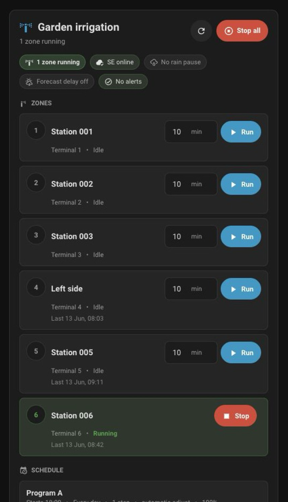

# Rain Bird IQ4 Integration for Home Assistant

[](https://github.com/hacs/integration)

A Home Assistant custom integration for **Rain Bird IQ4** cloud-connected irrigation controllers (ESP-TM2, ESP-ME3 and compatible models).

> **Note:** This integration uses the unofficial Rain Bird IQ4 cloud API. It is not affiliated with or endorsed by Rain Bird Corporation. The API may change without notice.

---

## Requirements

- Home Assistant 2025.1 or newer
- Rain Bird IQ4 account (https://iq4.rainbird.com)
- A Rain Bird controller connected to the IQ4 cloud (e.g. ESP-TM2, ESP-ME3)
- Controller must be fully set up on the IQ4 web portal (https://iq4.rainbird.com) before installing this integration

---

## Features

- **Real-time station monitoring** — zone status (idle / running / paused), last run time, last completed run, active/inactive flag
- **Program monitoring** — schedule status for Weekly, Odd, Even and Cyclic programs, with next run date for all types
- **Rain delay sensor** — days remaining
- **Forecast rain delay** — enabled/disabled with threshold attributes
- **Controller status** — connected to cloud, operating mode, alarms and warnings
- **Multi-controller support** — accounts with multiple controllers can add each one as a separate integration entry
- **7 actions** to control irrigation, rain delay, and seasonal adjust settings
- **Calendar** — upcoming irrigation events per program (all schedule types supported)
- **Configurable polling intervals** — separate intervals for real-time, config, and program data
- **Manual refresh button** — force immediate update of all data, rate-limited to avoid excessive cloud requests
- **Optional Lovelace card** — compact zone controls with per-zone durations and optimistic feedback
- **Fault tolerance** — tolerates up to 3 consecutive API errors before marking entities unavailable
- **AWS WAF bypass** — all API calls use `curl_cffi` to impersonate a browser, ensuring compatibility across all controller types

---

## Installation

### Via HACS (recommended)

1. Open HACS in Home Assistant
2. Go to **Integrations** → click the three dots menu → **Custom repositories**
3. Add `https://github.com/davidsuarez82/rainbird_iq4` as an **Integration**
4. Search for **Rain Bird IQ4** and install
5. Restart Home Assistant

To use the bundled Lovelace card, add this dashboard resource after restarting:

```text
/rainbird_iq4/rainbird_iq4_card.js
```

Resource type: **JavaScript module**.

### Manual

1. Download the latest release
2. Copy the `custom_components/rainbird_iq4` folder to your HA `config/custom_components/` directory
3. Restart Home Assistant

For the bundled Lovelace card, add this dashboard resource:

```text
/rainbird_iq4/rainbird_iq4_card.js
```

Resource type: **JavaScript module**.

---

## Configuration

1. Go to **Settings → Devices & Services → Add Integration**
2. Search for **Rain Bird IQ4**
3. Enter your Rain Bird IQ4 username and password
4. If you have multiple controllers, select the one to configure

Repeat the process to add additional controllers.

### Options

After setup, click **Configure** on the integration to adjust the authentication channel and polling intervals:

| Setting | Default | Range | Description |
|---|---|---|---|
| Authentication channel | Web portal | Web portal / Mobile app | How the integration logs in. Use *Mobile app* if zone control fails with a 403 (see Known Limitations). Changing this reloads the integration. |
| Real-time interval | 30s | 10–300s | Station status, alarms |
| Config interval | 5 min | 60–3600s | Rain delay, forecast, controller mode |
| Program interval | 1 hour | 5 min–24h | Programs, schedules, seasonal adjust |

---

## Entities

### Sensors
| Entity | Description |
|---|---|
| Station 001–N | Zone status: `idle` / `running` / `paused` |
| Program A–N Status | Program status: `scheduled` / `not scheduled` / `disabled` |
| Rain Delay | Days remaining (0 = no delay) |
| Controller Mode | `auto` / `off` |
| Alarms | Unacknowledged alarm count |
| Warnings | Unacknowledged warning count |

**Station attributes:** terminal, last_run, last_run_completed, remaining time, is_active

**Program attributes (Weekly):** start_time, schedule_type, week_days, steps, weather_adjust, seasonal_adjust, next_run

**Program attributes (Odd/Even):** start_time, schedule_type, excluded_days, steps, weather_adjust, seasonal_adjust, next_run

**Program attributes (Cyclic):** start_time, schedule_type, skip_days, excluded_days, steps, weather_adjust, seasonal_adjust, next_run

### Binary Sensors
| Entity | Description |
|---|---|
| Connected | Controller connected to IQ4 cloud |
| Forecast Rain Delay | Forecast-based rain delay enabled |

**Forecast attributes (when enabled):** percent threshold, rainfall threshold (inches), delay_days

### Calendar
One calendar entity per scheduled program showing upcoming irrigation events. Supports Weekly, Odd, Even and Cyclic schedule types.

### Button
- **Refresh** — triggers immediate update of all three coordinators

Refresh requests are rate-limited to one successful refresh every 30 seconds. This prevents repeated button presses or stale browser tabs from generating a burst of cloud API calls.

---

## Lovelace Card

The integration includes an optional dashboard card for quick irrigation control.



Add this card manually to a dashboard:

```yaml
type: custom:rainbird-iq4-card
title: Garden irrigation
auto: true
default_duration: 10
```

The card auto-discovers Rain Bird IQ4 station sensors, shows connection/rain-delay/alert status, and lets you set a separate duration for each zone before starting it.

Card options:

| Option | Default | Description |
|---|---|---|
| `title` | `Rain Bird IQ4` | Header shown on the card |
| `auto` | `true` | Auto-discover station entities |
| `default_duration` | `10` | Initial run duration in minutes |
| `entities` | unset | Fixed list of station entities |
| `show_programs` | `true` | Show program schedule/status rows |
| `hide_inactive_programs` | `false` | Hide programs that are not scheduled or disabled |
| `hide_inactive_stations` | `false` | Hide stations not assigned to any program |
| `refresh_throttle_seconds` | `30` | Minimum seconds between refresh button calls from the card |
| `start_refresh_delay_seconds` | `8` | Delay before refreshing after a zone starts |
| `stop_refresh_delay_seconds` | `5` | Delay before refreshing after a zone stops |

---

## Actions

| Action | Description |
|---|---|
| `rainbird_iq4.start_zone` | Start a zone manually (1–30 min) |
| `rainbird_iq4.stop_zone` | Stop a running zone |
| `rainbird_iq4.set_rain_delay` | Set rain delay in days (0 = clear) |
| `rainbird_iq4.enable_forecast_rain_delay` | Enable forecast-based rain delay |
| `rainbird_iq4.disable_forecast_rain_delay` | Disable forecast-based rain delay |
| `rainbird_iq4.set_weather_adjust_automatic` | Enable automatic seasonal adjust for a program |
| `rainbird_iq4.set_weather_adjust_manual` | Set manual seasonal adjust % for a program |

All zone and program actions use entity selectors filtered to Rain Bird IQ4 entities.

---

## Known Limitations

### US accounts: zone control returns 403

On **US-based accounts** without an active **IQ Access subscription**, Rain Bird's web/IQ channel caps account access (the controller shows as "0 Controller Tier" / greyed out on the IQ4 website). Since this integration logs in through that same web channel by default, manual zone control (`start_zone` / `stop_zone`) fails with `403` on `ManualOps/StartStations`. Read-only data (status, rain delay, alarms) still works.

**EU accounts are not affected** (confirmed in the Netherlands and Germany): full functionality works without any subscription.

**If you're in the US and hit this, you have two options:**

1. **Switch the authentication channel to "Mobile app" (no subscription needed).** Go to the integration's **Configure** screen and set **Authentication channel** to *Mobile app*. This logs in the same way the official Rain Bird 2.0 app does, which is not subject to the web-channel cap, so zone control works on the free tier. You can also pick this channel when first adding the integration.
2. **Activate Rain Bird's free 1-month IQ Access trial** from the IQ4 website (Admin → Subscriptions → IQ Access), which restores the web channel too.

This is a restriction on Rain Bird's account tiers, not a bug in this integration.

### Other limitations

- **Unofficial API** — Rain Bird does not provide a public API. This integration reverse-engineers the IQ4 web app traffic. It may break if Rain Bird changes their backend.
- **AWS WAF** — The Rain Bird cloud is protected by AWS WAF, which blocks standard HTTP clients. This integration uses `curl_cffi` to impersonate a browser. Excessive login attempts may trigger a temporary ban.
- **Cloud-dependent** — The integration requires an active internet connection and Rain Bird IQ4 cloud service. Local control is not supported.
- **Token-based auth** — Authentication tokens are cached on disk and refreshed automatically every ~2 hours. A restart may briefly show entities as unavailable while the token is refreshed. Since v1.0.7 the cache lives in `/config/.storage/rainbird_iq4_token_<account-hash>.json` (one file per account, survives HACS updates). The old file at `custom_components/rainbird_iq4/rainbird_iq4_token.json` is unused and can be deleted.
- **Timestamps in local time** — Rain Bird event log timestamps are in controller local time, not UTC.

---

## Tested Hardware

| Model | Firmware | Status |
|---|---|---|
| Rain Bird ESP-TM2 | 2.29.0 | ✅ Full support |
| Rain Bird ESP-ME3 | 3.11.0 | ✅ Full support (requires complete IQ4 web setup) |

Please open an issue if you have a different model and want to help test.

---

## Troubleshooting

**Controller shows as "Demo" or entities show weird data:** make sure the controller is fully set up on the IQ4 **website** (not just the mobile app). Remove any leftover Demo controller from your IQ4 account, verify your real controller appears at https://iq4.rainbird.com, and go through its configuration pages once, saving the settings. Then reload the integration.

If the integration fails to load or entities are missing, you can run the diagnostic script to check which API endpoints are available for your controller:

```bash
curl -O https://raw.githubusercontent.com/davidsuarez82/rainbird_iq4/main/tools/diagnose.sh
chmod +x diagnose.sh
./diagnose.sh your@email.com yourpassword
```

Share the generated `diagnostic_*.json` file in a GitHub issue.

---

## Contributing

Contributions are welcome. Please open an issue before submitting a pull request to discuss the proposed change.

If Rain Bird changes their API and the integration breaks, issues with debug logs are especially helpful.

---

## License

MIT

---

## Credits

- [@andreypopov](https://github.com/andreypopov) — Lovelace card and refresh rate limiting
- [@allenporter](https://github.com/allenporter) — IQ4 protocol specification and pyrainbird collaboration
- Inspired by the work discussed in [HA Core issue #142123](https://github.com/home-assistant/core/issues/142123)
